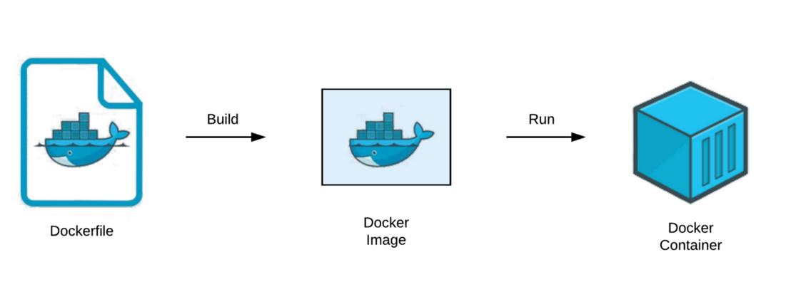

# Dockerfile



## What is Dockerfile ?

Docker can build images automatically by reading the instructions from a Dockerfile. A Dockerfile is a text document that contains all the commands a user could call on the command line to assemble an image. Dockerfile are another option for creating container images that addresses limitations such image size, and repeatable. Dockerfile are easy to share, version control, reuse, and extend.

Why using Dockerfile

1. Add new runtime libraries, such as database connectors.
2. Include organization-wide customization such as SSL certificates and authentication providers.
3. Add internal libraries to be used by multiple container images for different applications.
4. Trim the container image by removing unused material (such as man pages, or documentation found in /usr/share/doc).
5. Lock either the parent image or some included software package to a specific release to lower risk related to future software updates.

## Write the Dockerfile Specification

A Dockerfile is a text file named either Dockerfile or Dockerfile that contains the instructions
needed to build the image.

```dockerfile
# Comment
INSTRUCTION arguments
```

The first non-comment instruction must be a  `FROM` instruction to specify the base image. 

Dockerfile instructions are executed into a new container using this image and then committed
to a new image. Each Dockerfile instruction runs in an independent container using an intermediate image built from every previous command.


## Build Custom Image With Dockerfile

A Dockerfile is a mechanism to automate the building of container images. Building an image from a Dockerfile is a three-step process.

1. Create a working directory
2. Write the Dockerfile
3. Build the image with Docker

The following is an example Dockerfile for building a simple Apache web
server container

```dockerfile
# This is a comment line
FROM ubi8/ubi:8.5
LABEL description="This is a custom httpd container image"
MAINTAINER John Doe <jdoe@xyz.com>
RUN yum install -y httpd
EXPOSE 80
ENV LogLevel "info"
ADD http://someserver.com/filename.pdf /var/www/html
COPY ./src/ /var/www/html/
USER apache
ENTRYPOINT ["/usr/sbin/httpd"]
CMD ["-D", "FOREGROUND"]
```

1. Lines that begin with a hash, or pound, sign `#` are comments.
2. The `FROM` instruction declares that the new container image extends `ubi8/ubi:8.5`
container base image. Containerfiles can use any other container image as a base image, not
only images from operating system distributions.
3. The `LABEL` is responsible for adding generic metadata to an image. A `LABEL` is a simple keyvalue pair.
4. `MAINTAINER` indicates the `Author` field of the generated container image's metadata. You
can use the `docker image inspect <image-name>` command to view image metadata.
5. `RUN` executes commands in a new layer on top of the current image. The shell that is used to
execute commands is `/bin/sh`.
6. `EXPOSE` indicates that the container listens on the specified network port at runtime. The
`EXPOSE` instruction defines metadata only; it does not make ports accessible from the host.
The `-p` option in the `podman run` or `docker run` command exposes container ports from the host.
7. `ENV` is responsible for defining environment variables that are available in the container. You
can declare multiple `ENV` instructions within the Dockerfile. You can use the `env` command
inside the container to view each of the environment variables.
8. `ADD` instruction copies files or folders from a local or remote source and adds them to the
container's file system. If used to copy local files, those must be in the working directory. ADD
instruction unpacks local `.tar` files to the destination image directory.
9. `COPY` copies files from the working directory and adds them to the container's file system. It
is not possible to copy a remote file using its URL with this Dockerfile instruction.
10. `USER` specifies the username or the `UID` to use when running the container image for the
`RUN`, `CMD`, and `ENTRYPOINT` instructions. It is a good practice to define a different user other
than `root` for security reasons.
11. `ENTRYPOINT` specifies the default command to execute when the image runs in a container.
If omitted, the default `ENTRYPOINT is /bin/sh -c`.
12. `CMD` provides the default arguments for the `ENTRYPOINT` instruction. If the default
`ENTRYPOINT` applies `(/bin/sh -c)`, then `CMD` forms an executable command and
parameters that run at container start.

## Building Images

```bash
#specific building Dockerfile in current directory
docker build -t test-image:0.01 .
```

```bash
#specific building Dockerfile wih path directory
docker build -t test-image:0.01 -f Docker/Dockerfile .
```

`-t`: used to give image you will be build a tag.

`-f`: Locate your docker file location inside directory.