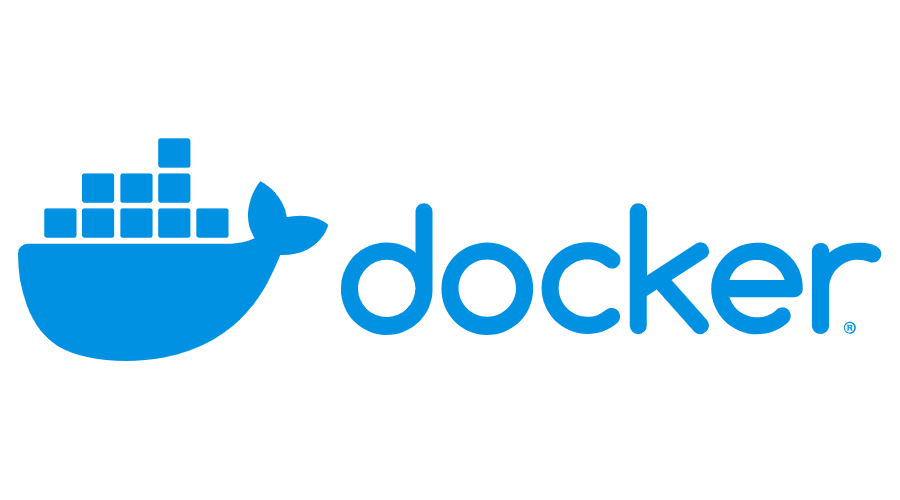

# Docker Installation



## Install Docker Engine on RHEL

To get started with Docker Engine on RHEL, make sure you meet the prerequisites, then install Docker.

## OS Requirements

To install Docker Engine, you need a maintained version of RHEL 7, RHEL 8 or RHEL 9.

## Uninstall old versions docker

Older versions of Docker if these are installed, uninstall them, along with associated dependencies.

```bash
 sudo yum remove docker \
                 docker-client \
                 docker-client-latest \
                 docker-common \
                 docker-latest \
                 docker-latest-logrotate \
                 docker-logrotate \
                 docker-engine \
```

## Uninstall podman and runc

it is better to delete podman first to avoid conflicts between podman and docker

```bash
 sudo yum remove podman \
                 runc
```

## Installation using the repository

Before you install Docker Engine for the first time on a new host machine, you need to set up the Docker repository. Afterward, you can install and update Docker from the repository.

### Set up the repository

```bash
sudo yum install -y yum-utils
sudo yum-config-manager \
     --add-repo \
     https://download.docker.com/linux/centos/docker-ce.repo
```

### Install the docker engine

1. Install the latest version of Docker Engine, containerd, and Docker Compose or go to the next step to install a specific version:

```bash
sudo yum install docker-ce docker-ce-cli containerd.io docker-compose-plugin
```

2. To install a specific version of Docker Engine, list the available versions in the repo, then select and install:

```bash
# List and sort the versions available in your repo. This example sorts results by version number, highest to lowest, and is truncated:
yum list docker-ce --showduplicates | sort -r
# Install a specific version
sudo yum install docker-ce-<VERSION_STRING> docker-ce-cli-<VERSION_STRING> containerd.io docker-compose-plugin
```

### Start Docker

Not forget to turn on the docker service.

```bash
#start service
sudo systemctl start docker.service

#Check status service
sudo systemctl status docker.service

```

### Deploy Container

Verify that Docker Engine is installed correctly by running the hello-world image.

```bash
#This command downloads a test image and runs it in a container. When the container runs, it prints a message and exits.
sudo docker run hello-world
```
